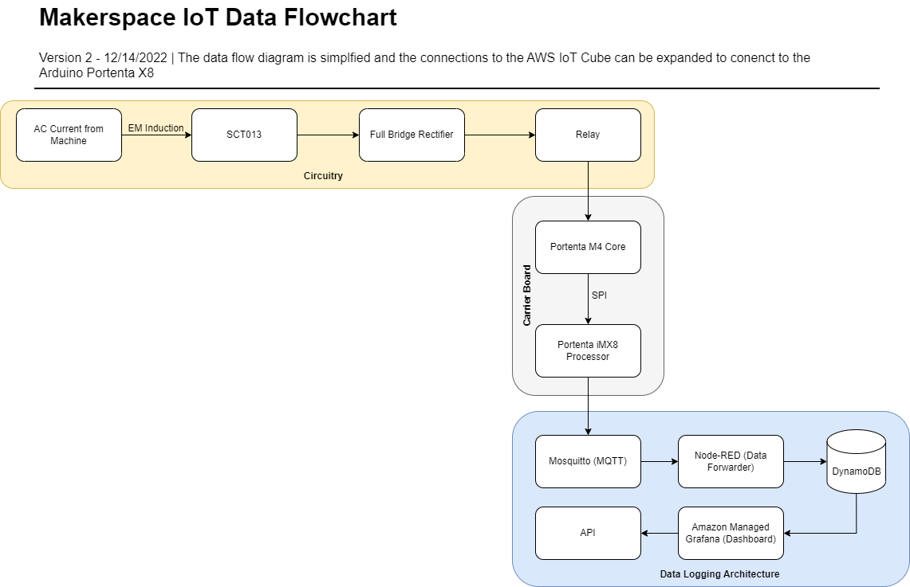

# [Makerspace IoT (MSIoT)](https://github.com/GeorgiaTech-DDI/makerspace_iot/wiki)

Makerspace IoT is a sub-project of the Smart^3 Makerspaces Vertically Integrated Project, aiming to digitalize and provide actionable insights for machines in the Flowers Invention Studio.

This is achieved using sensors which continuously collect data on various parameters (current, vibration, temperaure) for a machine. The projects aims to create one of a kind low cost, scalable IoT infrastructure which aids in predective maintenence of the machinery.

This wiki provides a live documentation of the resources utilized in the project. 

## [Documentation](https://github.com/GeorgiaTech-DDI/makerspace_iot/wiki)
MSIoT documents, setups, and details on progress.

## Additional Information
[MAC Address Indentifier](https://randomnerdtutorials.com/get-change-esp32-esp8266-mac-address-arduino/)
