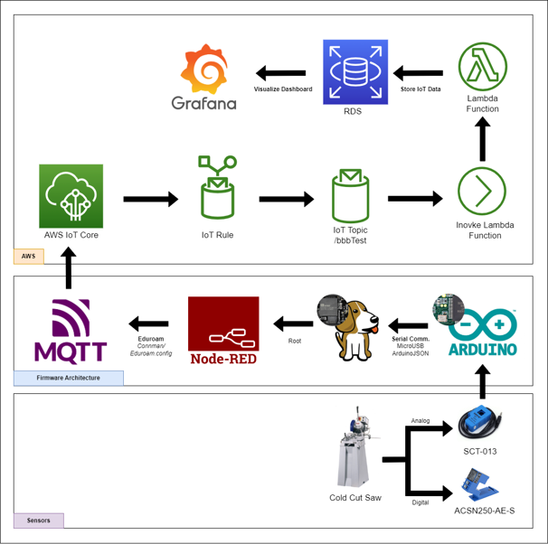

# [Makerspace IoT (MSIoT)](https://github.com/GeorgiaTech-DDI/makerspace_iot/wiki)

Makerspace IoT is a sub-project of the Smart^3 Makerspaces Vertically Integrated Project, aiming to digitalize and read machinery data from the Flowers Invention Studio. This wiki provides a live documentation of what have been done towards the Makerspace IoT project, 

## [Documentation](https://github.com/GeorgiaTech-DDI/makerspace_iot/wiki)
MSIoT documents, setups, and details on progress.

## Additional Information
[MAC Address Indentifier](https://randomnerdtutorials.com/get-change-esp32-esp8266-mac-address-arduino/)