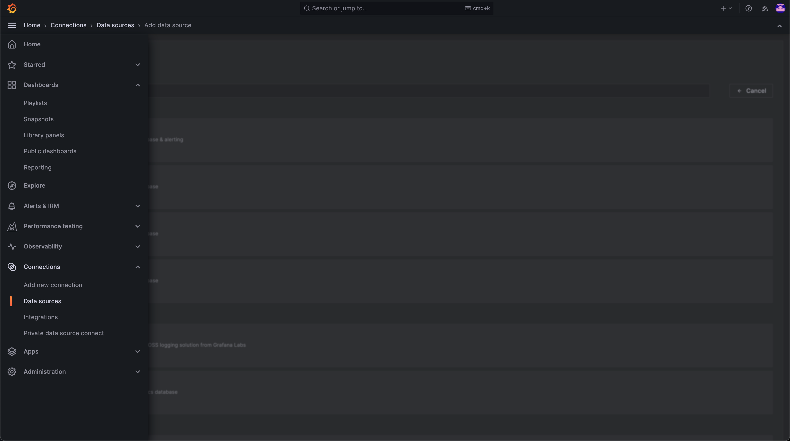
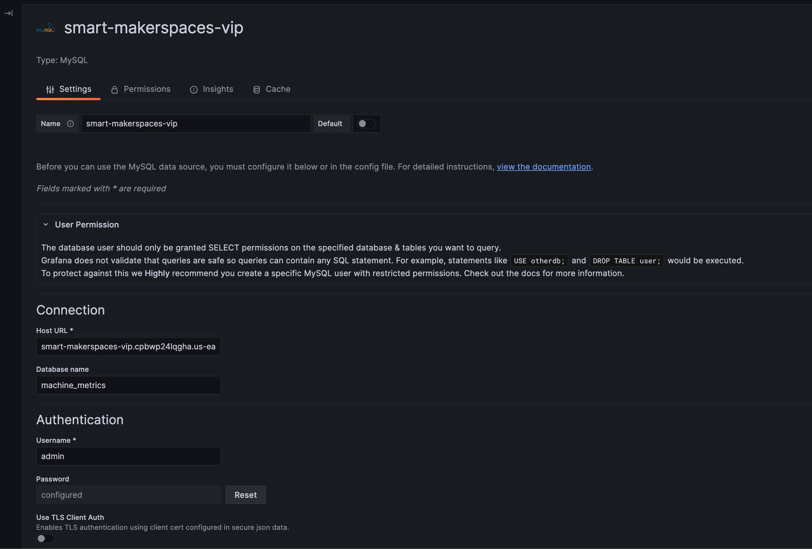
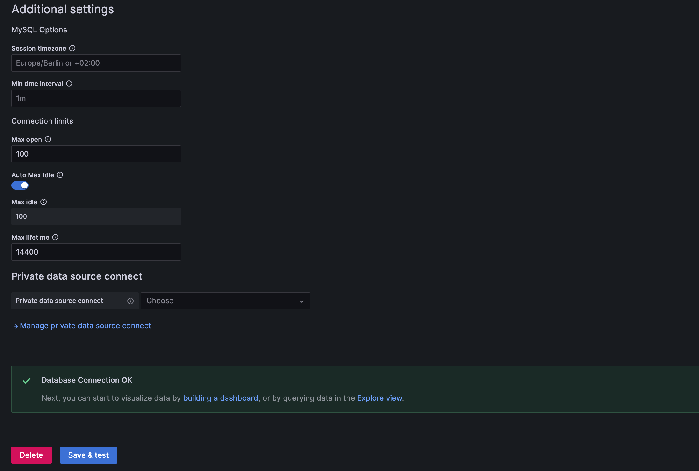
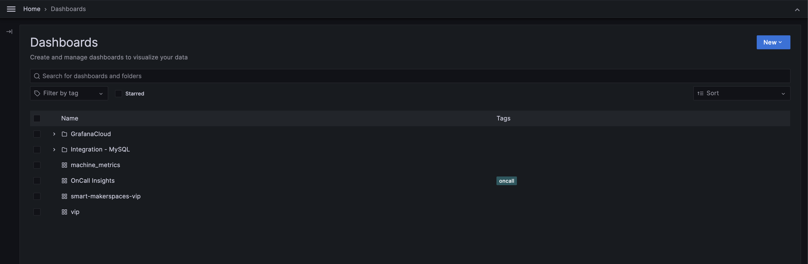
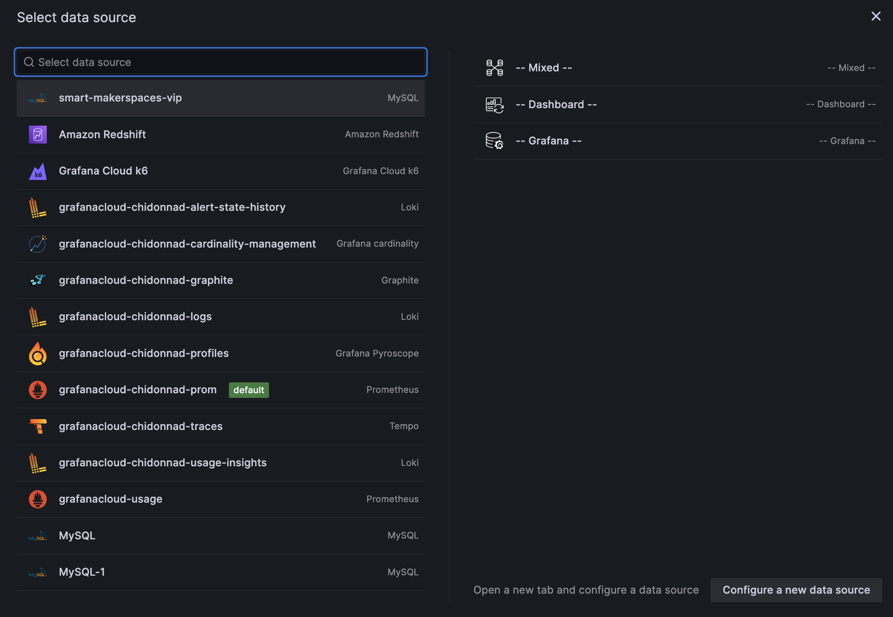
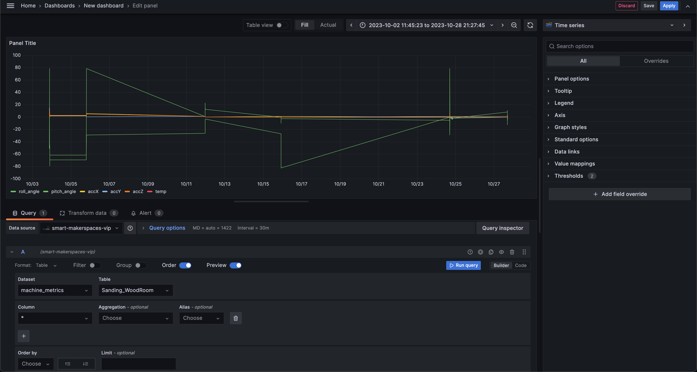
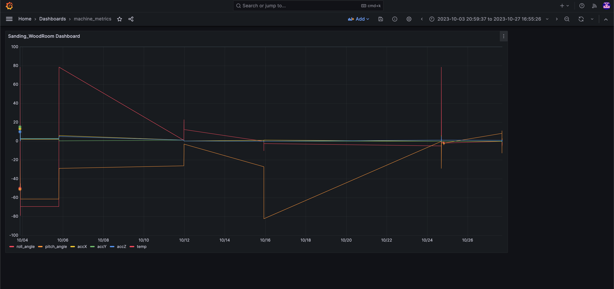

# Grafana

Grafana is a web tool we use to visualize sensor data that is stored in database tables.

- [Connecting to a Database](#Connecting-to-a-Database)
- [Creating/Editing a Visualization](#Creating/Editing-a-Visualization)
- [Viewing Data](#Viewing-Data)
- [Grafana Docs](#Grafana-Docs)

## Connecting to a Database

To connect to a database, first login to Grafana Cloud.

Once you're Grafana Cloud, go to Home > Connections > Data sources > Add data source.

Then, select MySQL from the available options. From here, give the data source a name and configure
it with the relevant information – Host URL, Database name, Username, and Password. This information
can be obtained from the software team. Then, scroll down and select _Save & test_ to ensure the
connection is good. You're now ready to [create a visualization](#reating-a-Visualization).

## Creating/Editing a Visualization

Before we can [view data](#Viewing-Data), there must be a visualization to begin with. To
create/edit a visualization, go to Home > Dashboards. From here, you can select an existing
dashboard to edit or _New_ to make a new one. Upon selecting _New_, go to New dashboard > Add
visualization, and then select your data source.

Once your data source is selected, you can configure the dashboard to pull data from it. This is
done by selecting the dataset, table, and columns we want The below image shows an example that
shows how data changes with time. Note that a time column is essential to do this.

There are many other options for visualizations. Use the menu to the right to select different types
of charts and graphs. You can also edit colors, fonts, and styles.

This creates a panel that is added to the dashboard. A dashboard can have multiple panels. To do
this, go to the dashboard and select Add > Visualization.

## Viewing Data

To view data, go to Home > Dashboards and select the dashboard with the data you want.

## Grafana Docs

For more about Grafana, visit [this page](https://grafana.com/docs/grafana-cloud/) for
documentation.
