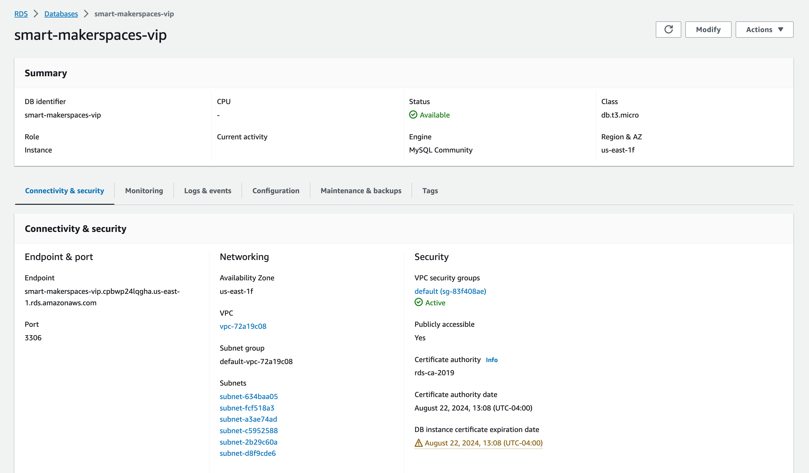
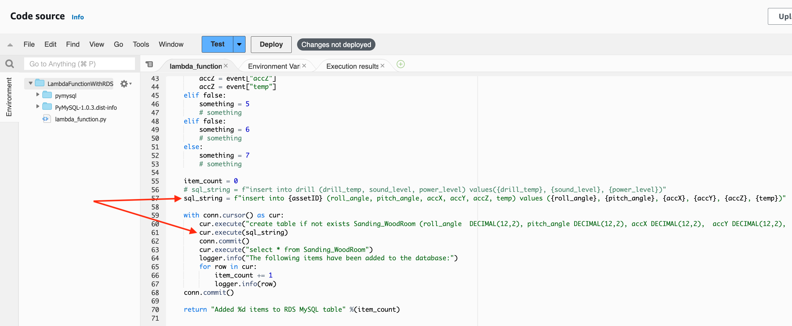
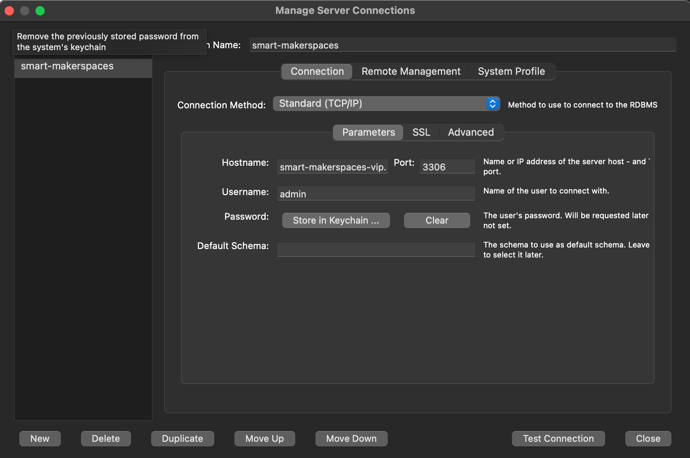
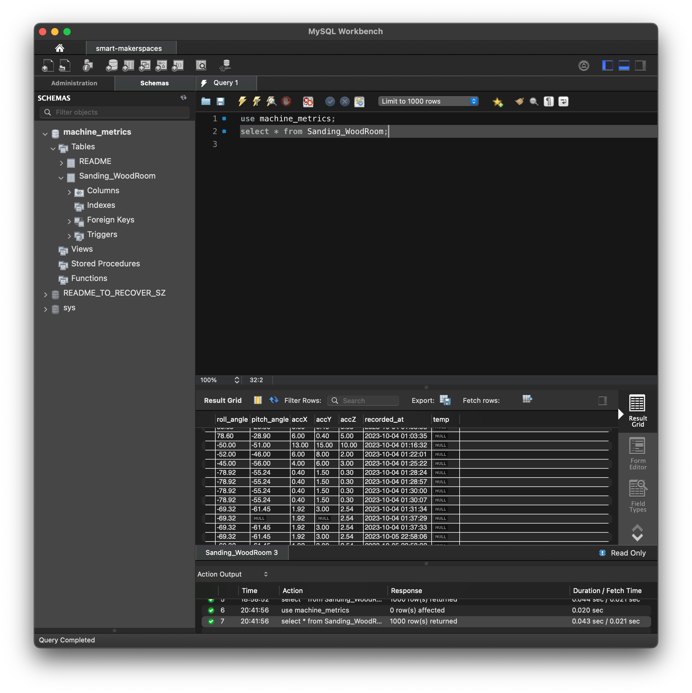

# SQL

Structured Query Language SQL a programming language for storing and processing information in a
relational database. We use it to store data that comes in from sensors. To interact with it, a
database management system (DBMS) is needed. We use the MySQL DBMS.

- [AWS RDS](#AWS-RDS)
- [Main Use Case](#Main-Use-Case)
- [Interacting with the Database Outside Lambda](#Interacting-with-the-Database-Outside-Lambda)
- [More about MySQL](#MySQL-Docs)

## AWS RDS

AWS RDS serves/hosts the database. It handles running the database so we don't need to worry about
it. Once a database is created, information about it can be found in the AWS console. However, to
actually see the data, we need a DBMS or visualization too. This is where
[MySQL Workbench](#Interacting-with-the-Database-Outside-Lambda) and Grafana are needed.

## Main Use Case

If a connection is established, running a valid SQL query against a database will take some effect.
The main effect we want is to store data into our database when it is sent by the sensors. This is
done in the Lambda function. Sensors sending data triggers the lambda function which connects to the
database and runs an SQL query to put data in the database.

For more on what Lambda does, please see the Lambda docs.

## Interacting with the Database Outside Lambda

For a pictoral representation of the data, use Grafana. Visit the Grafana docs for an explanation.

While Grafana is nice for visuals, it cannot execute SQL commands or quickly display specific raw
data. For this, you want to use MySQL Workbench.

### MySQL Workbench

MySQL Workbench allows us to interact with MySQL. To get started,
[download MySQL Workbench](https://dev.mysql.com/downloads/workbench/).

Once you're in, setup a new database connection providing the necessary info. This info can be found
in the [AWS RDS](#AWS-RDS) console.

Once, run commands as needed to interact with the data. The example below specifies that we want the
machine metrics dataset and then shows all data in the Sanding_WoodRoom table.

## MySQL Docs

For more about MySQL, visit [this page](https://dev.mysql.com/doc/) for documentation.
